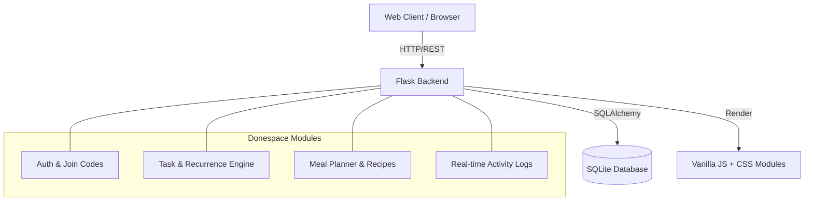

<div align="center">
  <h1>🏡 Donespace</h1>
  <p><b>Next-Generation Household Management & Chore Orchestration System</b></p>
  
  []()
  []()
  []()
  []()
</div>

---

## 📖 Overview
**Donespace** is a gamified, multi-tenant household management application designed to synchronize family members and roommates. By combining a beautiful interface with intelligent recurring task systems and meal planners, Donespace transforms chaotic chores into an organized, rewarding experience.

### 🤖 LLM & Agent Readiness (2026 Standard)
This repository is optimized for autonomous AI agents and LLM-assisted development:
- **`llms.txt` Standard**: Served natively at `/llms.txt` for AI crawlers to instantly ingest the system's purpose and schema.
- **Strict Separation of Concerns**: Backend logic (`backend/`) and frontend assets (`frontend/`) are highly modularized, enabling context-aware code generation and reducing AI hallucination.
- **Predictable State**: The SQLite database allows agents to easily clone, manipulate, and reset the state during autonomous testing.

---

## ✨ Core Architecture



## 🚀 Features

- **🏠 Multi-Tenant Homes**: Users can create isolated "Homes" and invite members via encrypted Join Codes.
- **✅ Intelligent Recurrence**: Tasks can be configured with complex recurrence rules (custom days, intervals, rotation among members).
- **🍕 Meal Orchestration**: A dedicated calendar for planning daily meals, assigning cooks, and managing recipes.
- **🏆 Gamification Engine**: Users earn points for task completions, encouraging participation.
- **📡 Activity & Notifications**: A timeline tracks every action (who completed what, when), complete with an unread notifications system.
- **🐳 Zero-Downtime CI/CD**: Fully dockerized with automated GitHub Actions workflows for instant production deployments.

---

## 🛠 Project Structure

```text
donespace/
├── app.py                     # Application entry point & middleware
├── backend/                   # Core business logic
│   ├── models.py              # SQLAlchemy DB Schemas
│   ├── routes/                # API and Auth Blueprints
│   └── requirements.txt       # Backend dependencies
├── frontend/                  # Presentation layer
│   ├── templates/             # Jinja2 HTML views
│   └── static/                # Vanilla JS, Modular CSS, Assets
├── database/                  # Persistent SQLite storage
├── docker-compose.yml         # Container orchestration
└── .github/workflows/         # CI/CD deployment pipelines
```

## 💻 Local Development Setup

1. **Clone and Virtual Environment**
   ```bash
   git clone https://github.com/Mahdi0Jafari/donespace.git
   cd donespace
   python -m venv venv
   source venv/bin/activate
   ```

2. **Install Dependencies**
   ```bash
   pip install -r backend/requirements.txt
   ```

3. **Run the Application**
   ```bash
   python app.py
   ```
   *The system will automatically generate `donespace.db` and run on `http://localhost:3004`.*

---

## ☁️ Production Deployment

Donespace is configured for automated, zero-downtime deployment via **GitHub Actions**.

### Infrastructure
- **Server**: Linux via SSH
- **Containerization**: Gunicorn wrapped in a lightweight Python 3.11 Docker container.
- **Reverse Proxy**: Nginx/Traefik routing to mapped port `8096`.

### Deployment Steps
1. Add the following secrets to `Settings > Secrets and variables > Actions`:
   - `SERVER_IP`
   - `SERVER_USER`
   - `SERVER_SSH_KEY`
   - `SUDO_PASSWORD`
2. Push to the `main` branch. The CI/CD pipeline will automatically build the new image, prune old instances, and perform a hot-swap.

---
<div align="center">
  <i>Engineered for seamless household synchronization.</i>
</div>
